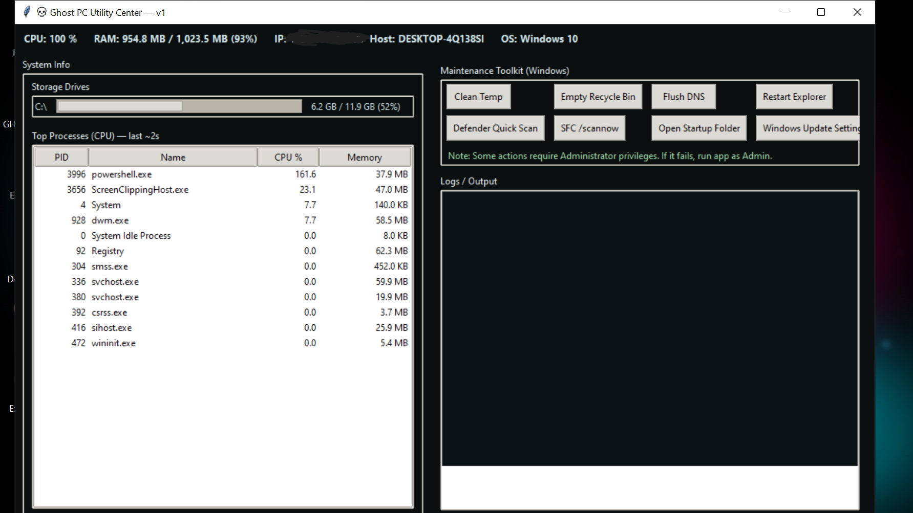
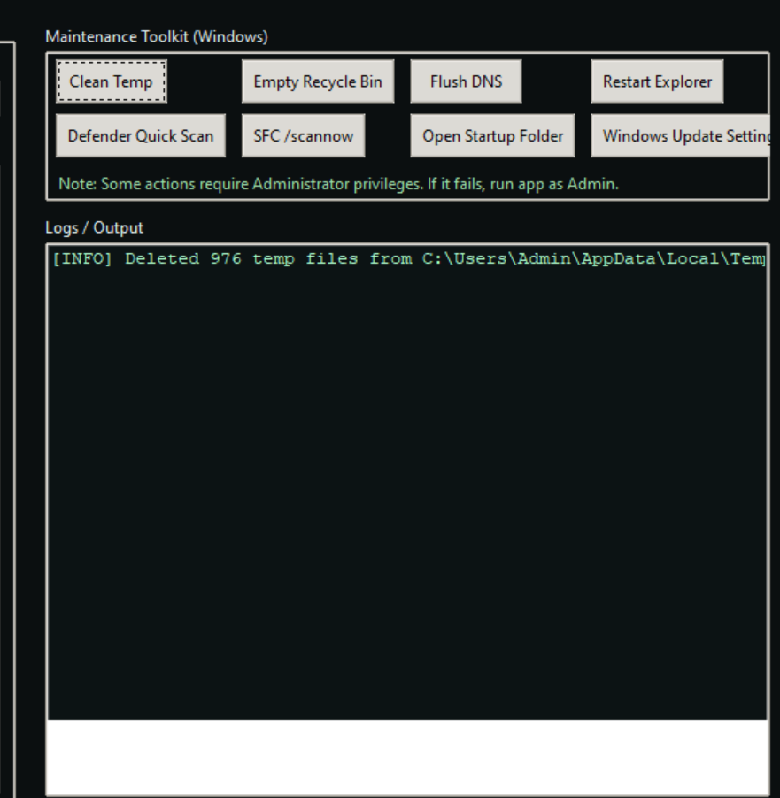

# Ghost Toolkit 🛠️

A lightweight Windows utility for system information & maintenance — built as my first GitHub project to learn development, version control, packaging, and software releases.

---

## 🚀 Download
🔽 **Latest EXE Release:**  
https://github.com/Sudo-Ghost77/Ghost-toolkit/releases/latest

Run the file — no installation needed.

> If Windows SmartScreen warns you, click **More info → Run anyway**  
> (this EXE is unsigned since it’s a personal project).

---

## 📦 Features

✅ Display Windows version  
✅ Show total & used RAM  
✅ Clean temporary files  
✅ View top resource-using processes  
✅ Portable `.exe` (no install)

### 🧠 Future Upgrades
- RAM cleaner
- Startup program manager
- Task manager killer
- System health & security checks
- Full GUI release

---

## 📷 Screenshots

### Main Interface


### Cleanup Example


---

## 🏗️ Run from source

```bash
pip install -r requirements.txt
python ghost_pc_utility_v1.py


## ✨ Credits

Made by **Ghost** (`Sudo-Ghost77`) 🕶️🔥  

